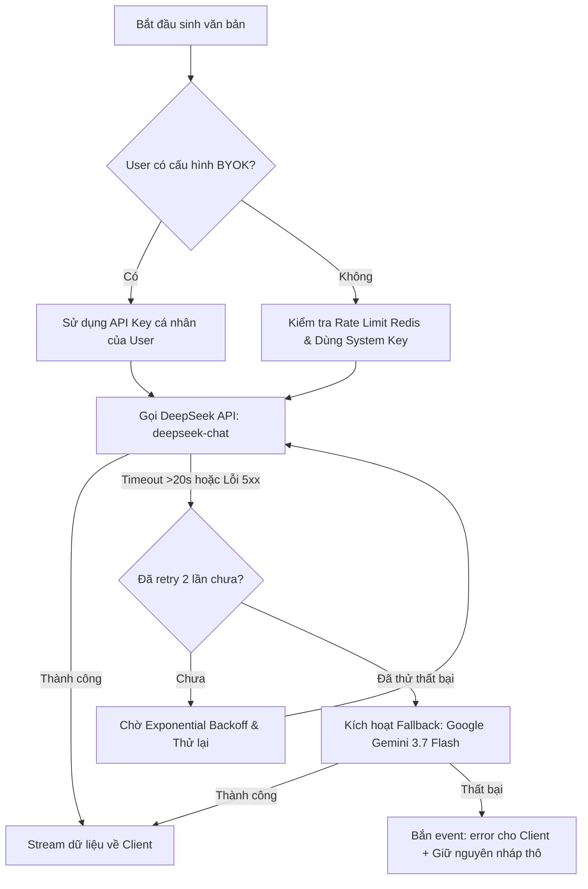

# GIAO THỨC TRUYỀN TẢI DÒNG DỮ LIỆU AI (AI STREAMING PROTOCOL SPECIFICATION)

> **Mã tài liệu:** API-002  
> **Phân cấp ưu tiên:** **P1 (High — Hoàn thiện Core Engines Phase 1–2)**  
> **Trạng thái:** Approved  
> **Giao thức:** Server-Sent Events (SSE - HTTP/1.1 or HTTP/2)  
> **Endpoint:** `POST /api/ai/generate/stream` và `POST /api/ai/chat/stream`  
> **Cập nhật lần cuối:** 2026-09-05  

---

## 1. TỔNG QUAN VỀ KIẾN TRÚC STREAMING

Để mang lại trải nghiệm gõ chữ trực tiếp theo thời gian thực (Typewriter Effect) tương tự ChatGPT và giảm độ trễ cảm nhận (Time To First Token - TTFT < 800ms), DOCDRAFT AI sử dụng **Server-Sent Events (SSE)** thay vì WebSocket vì các lý do:
1. Hoạt động trên giao thức HTTP tiêu chuẩn, thân thiện với tường lửa và mạng nội bộ cơ quan nhà nước.
2. Tiết kiệm tài nguyên server (kết nối 1 chiều từ server về client), dễ dàng tích hợp trên kiến trúc Edge/Serverless của Next.js App Router.
3. Hỗ trợ cơ chế tự động kết nối lại (Auto-reconnect) nguyên bản của trình duyệt.

```
┌──────────────┐                  ┌──────────────────┐                  ┌────────────────────┐
│   CLIENT     │                  │  NEXT.JS SERVER  │                  │  DEEPSEEK / GEMINI │
│ (EventSource/│                  │ (Route Handler)  │                  │ (OpenAI/Google SDK)│
│    fetch)    │                  │                  │                  │                    │
└──────┬───────┘                  └────────┬─────────┘                  └─────────┬──────────┘
       │                                   │                                      │
       │─── POST /api/ai/generate/stream ─▶│                                      │
       │    (Prompt, Form data, Model)     │─── openai.chat.completions.create() ─▶│
       │                                   │    (stream: true, model: deepseek-v3)│
       │◀── HTTP 200 (text/event-stream) ──│                                      │
       │                                   │◀── Token chunk 1 ────────────────────│
       │◀── event: content (Chunk 1) ──────│                                      │
       │                                   │◀── Token chunk 2 ────────────────────│
       │◀── event: content (Chunk 2) ──────│                                      │
       │                                   │                                      │
       │    [Mỗi 15s nếu nhàn rỗi]         │                                      │
       │◀── event: ping ───────────────────│ (Heartbeat)                          │
       │                                   │                                      │
       │                                   │◀── Stream finished (FinishReason) ───│
       │◀── event: done (Stats) ───────────│                                      │
       │                                   │                                      │
```

---

## 2. ĐẶC TẢ ĐỊNH DẠNG CÁC LOẠI SỰ KIỆN (SSE EVENT FORMAT)

Tất cả các dòng dữ liệu gửi về tuân thủ nghiêm ngặt chuẩn MIME `text/event-stream; charset=utf-8`:

### 2.1. Sự kiện nội dung (`event: content`)
Truyền tải từng mẩu token văn bản HTML được mô hình AI sinh ra:
```text
event: content
data: {"text": "<tr><td style=\"width:40%;\"><strong>UBND THÀNH PHỐ</strong></td>"}

```

### 2.2. Sự kiện giữ nhịp kết nối (`event: ping`)
Được máy chủ tự động phát đi mỗi **15 giây** để ngăn chặn reverse proxy (Cloudflare, Nginx) ngắt kết nối do timeout:
```text
event: ping
data: {"timestamp": 1757055015000}

```

### 2.3. Sự kiện hoàn tất (`event: done`)
Thông báo stream đã kết thúc an toàn, gửi kèm các thông số thống kê để frontend cập nhật UI:
```text
event: done
data: {"success": true, "word_count": 342, "finish_reason": "STOP", "model_used": "deepseek-chat", "duration_ms": 2840}

```

### 2.4. Sự kiện lỗi (`event: error`)
Báo hiệu lỗi trong quá trình sinh kèm chỉ dẫn cho Client biết lỗi có thể thử lại tự động hay không:
```text
event: error
data: {"code": "LLM_RATE_LIMIT", "message": "Hệ thống đang quá tải, đang chuyển sang mô hình dự phòng...", "retryable": true, "retry_after_ms": 2000}

```

---

## 3. CƠ CHẾ QUẢN LÝ VÒNG ĐỜI KẾT NỐI (LIFECYCLE & RESILIENCE)

### 3.1. Hủy kết nối phía Client (AbortController Cleanup)
* **Vấn đề:** Khi người dùng bấm nút **"Dừng sinh"**, đóng tab, hoặc chuyển trang, nếu server tiếp tục đọc từ LLM sẽ gây lãng phí chi phí token API và tài nguyên CPU.
* **Giải pháp kỹ thuật:**
  * Client sử dụng `AbortController`:
    ```typescript
    const controller = new AbortController();
    // Khi user bấm Hủy:
    controller.abort();
    ```
  * Server Next.js lắng nghe tín hiệu `request.signal.addEventListener('abort', ...)`:
    * Ngay lập tức gọi lệnh ngắt kết nối SDK của DeepSeek / Gemini (`stream.controller.abort()`).
    * Đóng `TransformStream` và giải phóng bộ nhớ.

### 3.2. Chiến lược Thử lại với độ trễ lũy thừa (Exponential Backoff Retry)
Khi gặp sự cố mạng chập chờn hoặc mã lỗi `503 Service Unavailable`, `504 Gateway Timeout` từ AI Provider:
* **Lần thử 1:** Chờ `1000ms` trước khi gọi lại.
* **Lần thử 2:** Chờ `2000ms` trước khi gọi lại.
* **Lần thử 3:** Chờ `4000ms` trước khi gọi lại.
* **Tối đa:** 2 lần thử lại tự động. Nếu cả 2 lần đều thất bại, hệ thống tự động kích hoạt **Fallback Engine**.

### 3.3. Cơ chế Dự phòng Mô hình (Model Fallback Strategy)



---

## 4. TYPESCRIPT IMPLEMENTATION MẪU PHÍA CLIENT

```typescript
export async function streamDocumentGeneration(
  promptData: Record<string, any>,
  onToken: (chunk: string) => void,
  onComplete: (meta: any) => void,
  onError: (err: any) => void,
  signal: AbortSignal
) {
  try {
    const response = await fetch('/api/ai/generate/stream', {
      method: 'POST',
      headers: { 'Content-Type': 'application/json' },
      body: JSON.stringify(promptData),
      signal,
    });

    if (!response.ok) {
      throw new Error(`HTTP Error: ${response.status}`);
    }

    const reader = response.body?.getReader();
    if (!reader) return;

    const decoder = new TextDecoder('utf-8');
    let buffer = '';

    while (true) {
      const { done, value } = await reader.read();
      if (done) break;

      buffer += decoder.decode(value, { stream: true });
      const lines = buffer.split('\n\n');
      buffer = lines.pop() || '';

      for (const block of lines) {
        const [eventLine, dataLine] = block.split('\n');
        if (!eventLine || !dataLine) continue;

        const eventType = eventLine.replace('event: ', '').trim();
        const dataJson = JSON.parse(dataLine.replace('data: ', '').trim());

        switch (eventType) {
          case 'content':
            onToken(dataJson.text);
            break;
          case 'done':
            onComplete(dataJson);
            break;
          case 'error':
            onError(dataJson);
            break;
          case 'ping':
            // Heartbeat received, connection is healthy
            break;
        }
      }
    }
  } catch (error: any) {
    if (error.name === 'AbortError') {
      console.log('User cancelled document generation.');
    } else {
      onError(error);
    }
  }
}
```

---

## 5. ĐẶC TẢ CƠ CHẾ BYOK (BRING YOUR OWN KEY)

### 5.1. Mô hình hoạt động & Thứ tự ưu tiên (Precedence)
Cơ chế **BYOK** cho phép người dùng tự cung cấp API Key cá nhân của họ:
1. **Ưu tiên 1 (User Custom Key):** Nếu người dùng đã thiết lập `custom_api_keys.deepseek` (hoặc `custom_api_keys.gemini`) trong trang Hồ sơ cá nhân (Settings) → Hệ thống giải mã AES-256-GCM và gọi API bằng khóa của người dùng.
   * *Đặc quyền:* Yêu cầu sử dụng BYOK **không bị tính vào giới hạn Rate Limiting của hệ thống** (bỏ qua giới hạn 20 request/giờ của Redis) và không tiêu tốn ngân sách API của dự án.
2. **Ưu tiên 2 (System Default Key):** Nếu người dùng chưa cấu hình khóa cá nhân → Hệ thống sử dụng biến môi trường máy chủ `DEEPSEEK_API_KEY` (và fallback `GEMINI_API_KEY`), áp dụng chính sách giới hạn tần suất thông thường.

### 5.2. Bảo mật lưu trữ khóa API
* Khóa API cá nhân của người dùng **tuyệt đối không lưu dạng plain text** trong CSDL.
* Trước khi lưu vào cột `users.custom_api_keys`, backend mã hóa bằng thuật toán `AES-256-GCM` sử dụng khóa bí mật hệ thống `ENCRYPTION_MASTER_KEY`:
  ```typescript
  // Payload lưu trong users.custom_api_keys:
  {
    "deepseek": {
      "ciphertext": "a8f9c1...",
      "iv": "3d4e5f...",
      "auth_tag": "9b1c2d...",
      "updated_at": "2026-09-05T14:00:00Z"
    }
  }
  ```
* Khóa chỉ được giải mã trong bộ nhớ RAM tạm thời ngay trước khi khởi tạo client OpenAI/Gemini SDK và lập tức giải phóng sau khi stream hoàn tất.

