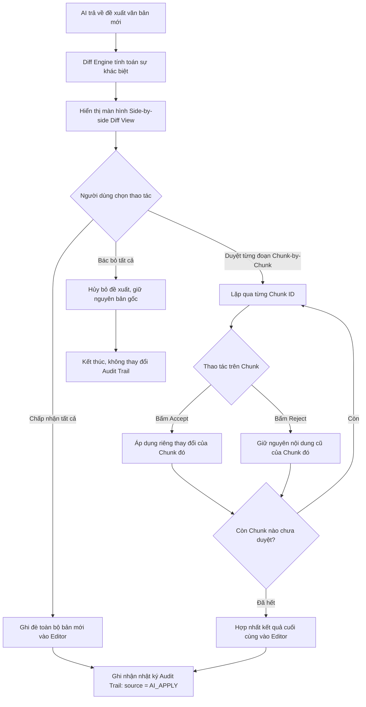

# THIẾT KẾ ĐỘNG CƠ DIFF-VIEW & NHẬT KÝ KIỂM TOÁN MINH BẠCH AI (DIFF & AUDIT ENGINE)

> **Mã tài liệu:** ARCH-003  
> **Phân cấp ưu tiên:** **P1 (High — Hoàn thiện Core Engines Phase 1–2)**  
> **Trạng thái:** Approved  
> **Mục tiêu:** Xây dựng niềm tin (Trust & Control) cho cán bộ hành chính & pháp chế  
> **Cập nhật lần cuối:** 2026-09-05  

---

## 1. BỐI CẢNH & TÂM LÝ NGƯỜI DÙNG (TRUST & CONTROL)

Trong công tác văn thư, hành chính và pháp chế:
* **Nỗi sợ lớn nhất:** AI tự ý thay đổi câu chữ nhạy cảm hoặc ghi đè làm mất dữ liệu gốc quan trọng mà người dùng không hay biết.
* **Yêu cầu bắt buộc của Doanh nghiệp / Tổ chức:** Phải có cơ chế giải trình (Accountability) rõ ràng: *Tài liệu này câu nào do người viết? Câu nào do AI đề xuất?*

Để giải quyết triệt để hai bài toán này, DOCDRAFT AI phát triển hai hệ thống liên kết chặt chẽ:
1. **Side-by-side Diff Engine:** Cho phép xem xét và duyệt từng đoạn đề xuất trước khi chèn vào bài.
2. **Audit Trail Logger:** Ghi nhận nguồn gốc chỉnh sửa đến từng ký tự và phiên bản.

---

## 2. KIẾN TRÚC ĐỘNG CƠ DIFF (DIFF-VIEW ENGINE)

### 2.1. Thuật toán so sánh (Diff Algorithm)
Hệ thống sử dụng thuật toán **Myers Diff Algorithm** (thông qua thư viện `jsdiff`) kết hợp duyệt cây ProseMirror:
* Thay vì chỉ so sánh chuỗi text thô, thuật toán so sánh ở mức **Khối cấu trúc (Block-level diff)**:
  * So sánh thuộc tính đoạn (căn lề, cỡ chữ).
  * So sánh bảng biểu: nhận diện hàng bị thêm/xóa, ô bị thay đổi nội dung.
* Kết quả tính toán diff được chia thành các mẩu thay đổi riêng biệt (**Diff Chunks**), mỗi chunk có định danh duy nhất (`chunk_id`).

### 2.2. Hai chế độ hiển thị linh hoạt
1. **Chế độ Chia đôi màn hình (Side-by-side Diff View):**
   * Sử dụng cho các tác vụ lớn: Viết lại toàn bộ văn bản nháp thô (Raw Polish) hoặc Áp dụng đề xuất từ AI Chat Sidebar.
   * *Cột trái (Bản gốc):* Đỏ nhạt gạch ngang những đoạn bị xóa bỏ.
   * *Cột phải (Bản AI):* Xanh lá highlight những đoạn mới thêm vào.
2. **Chế độ Trực tiếp trong Editor (Inline Diff / Track Changes):**
   * Sử dụng khi bôi đen gọi AI In-line Copilot (rút gọn, hành chính hóa).
   * Thay đổi hiển thị trực tiếp ngay tại đoạn văn đó kèm 2 nút bấm nổi: **[✓ Chấp nhận]** và **[✕ Bác bỏ]**.

---

## 3. LƯU ĐỒ DUYỆT TỪNG ĐOẠN ĐỀ XUẤT (CHUNK-BY-CHUNK ACCEPT/REJECT)



---

## 4. HỆ THỐNG NHẬT KÝ KIỂM TOÁN (AUDIT TRAIL & ATTRIBUTION)

### 4.1. Phân loại nguồn gốc chỉnh sửa (`edit_source`)
Mỗi phiên bản lưu trong bảng `draft_versions` bắt buộc phải có một trong 4 nhãn nguồn gốc:

| Mã `edit_source` | Ý nghĩa nghiệp vụ | Mức độ can thiệp của AI |
|---|---|---|
| `AI_GENERATE` | Sinh mới toàn văn từ Form mẫu hoặc Nháp thô | 100% AI sinh ban đầu |
| `AI_INLINE_EDIT` | Chỉnh sửa một đoạn bằng thanh công cụ AI Copilot | AI can thiệp cục bộ |
| `AI_CHAT_APPLY` | Áp dụng đoạn văn bản do AI Chat Sidebar tư vấn | AI tư vấn có chọn lọc |
| `USER_MANUAL` | Người dùng tự gõ phím chỉnh sửa trực tiếp | 0% AI (Con người tự viết) |

### 4.2. Cấu trúc dữ liệu ghi log chi tiết (`audit_logs`)

```typescript
export interface AuditLogEntry {
  id: string;
  draft_id: string;
  actor_id: string;
  action_type: 'CREATE' | 'AI_APPLY' | 'MANUAL_EDIT' | 'RESTORE_VERSION' | 'SUBMIT_APPROVAL';
  source: 'AI' | 'HUMAN';
  details: {
    words_added: number;
    words_removed: number;
    ai_model?: string;         // 'deepseek-chat' | 'gemini-3.7-flash'
    prompt_used?: string;
    affected_sections?: string[]; // ['Quốc hiệu', 'Căn cứ pháp lý']
    client_ip: string;
  };
  created_at: string;
}
```

### 4.3. Chỉ số đóng góp nội dung (AI Contribution Ratio)

Hệ thống tự động tính toán tỷ lệ đóng góp để hiển thị trực quan trên thanh trạng thái văn bản:
$$\text{Tỷ lệ AI} = \left( \frac{\text{Số từ do AI sinh còn tồn tại}}{\text{Tổng số từ của văn bản}} \right) \times 100\%$$

* **Ví dụ hiển thị:**  
  `Tỷ lệ đóng góp: 76% Người soạn thảo | 24% AI hỗ trợ`
* **Giá trị thực tiễn:** Khi in hoặc trình ký, lãnh đạo cơ quan có thể bấm xem **Báo cáo kiểm toán (Audit Summary)** để biết chính xác những điều khoản nào có sự can thiệp của trí tuệ nhân tạo, đảm bảo tính tuân thủ pháp lý cao nhất.
