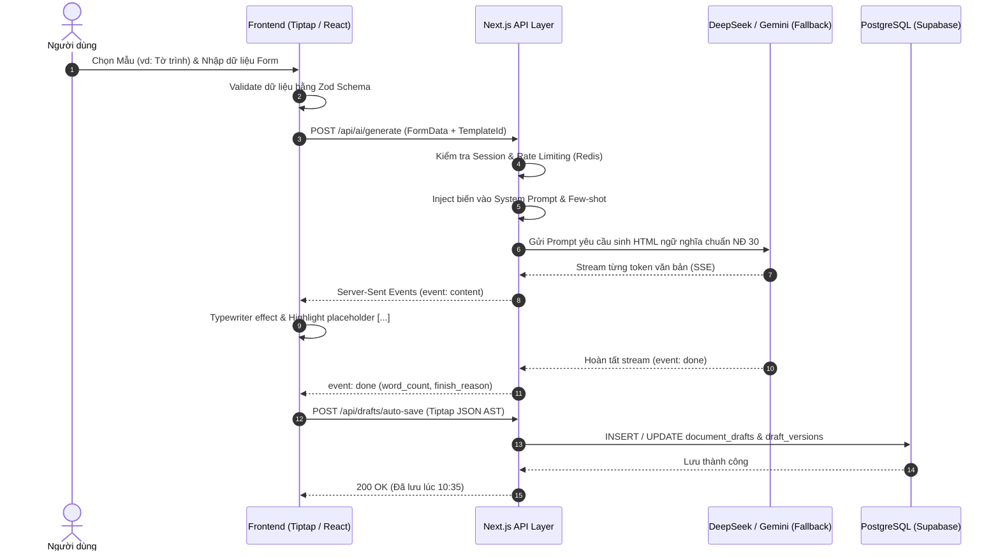
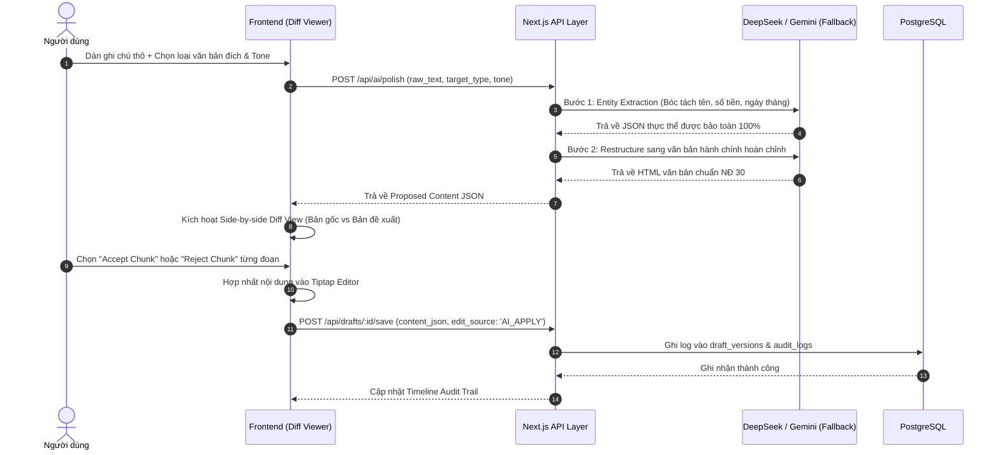
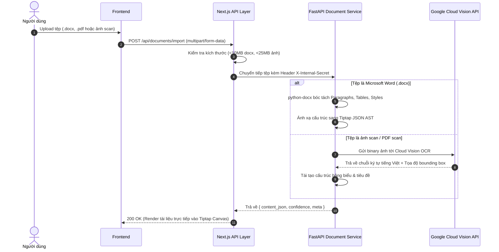
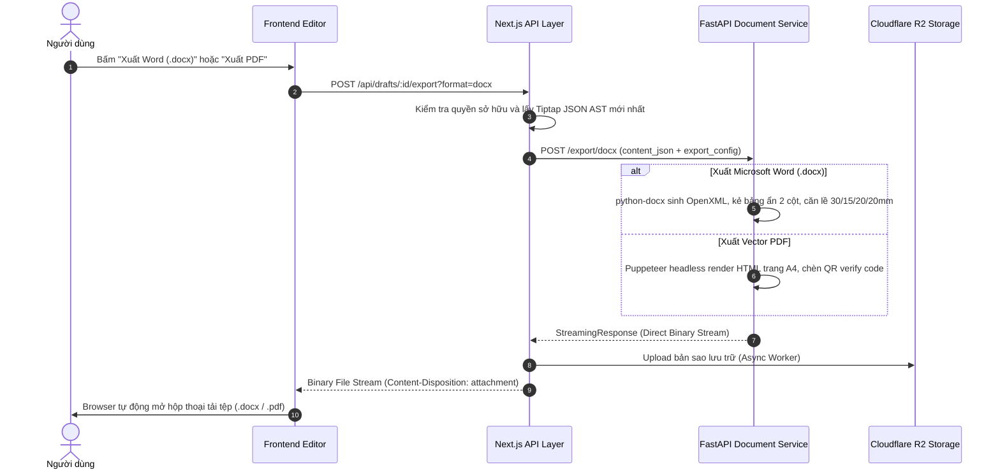

# KIẾN TRÚC HỆ THỐNG TỔNG QUAN (SYSTEM ARCHITECTURE OVERVIEW)

> **Mã tài liệu:** ARCH-001  
> **Phân cấp ưu tiên:** **P0 (Critical — Bắt buộc trước khi code MVP)**  
> **Trạng thái:** Approved  
> **Cập nhật lần cuối:** 2026-09-05  

---

## 1. MÔ HÌNH KIẾN TRÚC PHÂN TÁN (HYBRID ARCHITECTURE)

Hệ thống **DOCDRAFT AI** áp dụng mô hình phân tách trách nhiệm (Separation of Concerns) hiện đại giữa **Ứng dụng Web / API Core (Next.js 14+)** và **Document Processing Microservice (FastAPI Python)**.

```
┌─────────────────────────────────────────────────────────────────────────────┐
│                           [ CLIENT LAYER ]                                  │
│  ├── Web App: Next.js 14+ (App Router, Server Actions, Client Components)   │
│  ├── Rich Editor: Tiptap Core (ProseMirror AST) + Custom Extensions         │
│  ├── Diff Engine: jsdiff / react-diff-viewer (Side-by-side & Inline)        │
│  ├── Form Management: React Hook Form + Zod Dynamic Schema Validation       │
│  ├── State Management: Zustand (UI state) + TanStack Query (Server cache)   │
│  └── Extension: MS Word Task Pane Add-in (Office.js)                        │
└──────────────────────────────────────┬──────────────────────────────────────┘
                                       │ HTTPS / SSE Streaming / WSS
                                       ▼
┌─────────────────────────────────────────────────────────────────────────────┐
│                    [ CORE API LAYER - NEXT.JS ROUTE HANDLERS ]              │
│  ├── Auth Service: NextAuth.js v5 (Google OAuth 2.0, Credentials, RBAC)     │
│  ├── Document Drafts & Folder Management API                                │
│  ├── Approval Workflow Engine (State Machine: Submit, Review, Approve)      │
│  ├── Audit Trail Logger (AI Attribution & Change Tracking)                 │
│  ├── AI Orchestrator: DeepSeek API (DeepSeek-V3 / Chat) + BYOK Engine       │
│  │     └── Fallback Engine: Google Gen AI SDK (Gemini 3.7 Flash)            │
│  └── Legal Citation RAG Search (Vector Similarity Query qua pgvector)       │
└───────────────────┬─────────────────────────────────────┬───────────────────┘
                    │ Internal HTTP + X-Internal-Secret   │ SQL / pgvector
                    ▼                                     ▼
┌──────────────────────────────────────┐  ┌───────────────────────────────────┐
│   [ DOCUMENT SERVICE - FASTAPI ]     │  │      [ DATABASE & STORAGE ]       │
│  ├── OpenXML Engine: python-docx     │  │  ├── PostgreSQL 16 (Supabase)     │
│  │   (Render .docx chuẩn NĐ 30)      │  │  │   ├── Relational DB (14 Tables)│
│  ├── PDF Engine: Puppeteer/Chromium  │  │  │   ├── pgvector (Legal RAG)     │
│  │   (WYSIWYG Print + QR Watermark)  │  │  │   └── tsvector (Full-text FTS) │
│  ├── Document Parser: python-docx    │  │  ├── Redis (Upstash)              │
│  │   & pdfplumber (Import file)      │  │  │   └── Rate limit, Cache, Queue │
│  └── OCR Worker: Google Vision API   │  │  └── Cloudflare R2 (S3-Compatible)│
│      (Nhận diện tài liệu scan/ảnh)   │  │      └── Lưu file .docx, .pdf, ảnh│
└──────────────────────────────────────┘  └───────────────────────────────────┘
```

---

## 2. BIỂU ĐỒ TUẦN TỰ CÁC LUỒNG DỮ LIỆU CỐT LÕI (MERMAID SEQUENCE DIAGRAMS)

### 2.1. Luồng 1: Sinh văn bản từ Biểu mẫu động (Form-to-Document Flow)



---

### 2.2. Luồng 2: Chuẩn hóa nháp thô & Chế độ Diff-View (Raw Polish Flow)



---

### 2.3. Luồng 3: Import tệp tin có sẵn & Nhận dạng OCR (Import & OCR Flow)



---

### 2.4. Luồng 4: Xuất bản văn bản đa định dạng (Multi-Format Export Flow)



---

## 3. THIẾT KẾ BẢO MẬT & CÔ LẬP MẠNG (SECURITY & NETWORK TOPOLOGY)

1. **Giao tiếp liên dịch vụ (Service-to-Service Authentication):**
   * Toàn bộ các cuộc gọi từ Next.js API sang FastAPI Microservice đều bắt buộc đính kèm header:
     `X-Internal-Secret: <ENCRYPTED_SERVICE_TOKEN>`
   * FastAPI Microservice không công khai API ra ngoài Internet; chỉ chấp nhận truy cập từ dải IP nội bộ của Next.js hoặc thông qua VPC Peering.
2. **Cơ chế xác thực người dùng (User Authentication):**
   * Sử dụng NextAuth.js v5 với JWT phiên làm việc có chữ ký số (HMAC-SHA256).
   * Cookie phiên làm việc được thiết lập cờ `HttpOnly`, `Secure`, `SameSite=Lax` ngăn chặn 100% tấn công XSS trộm token.
3. **Phân quyền dữ liệu (Multi-tenant Data Isolation):**
   * Mọi truy vấn đọc/ghi bản nháp (`document_drafts`) bắt buộc phải có điều kiện `user_id = session.user.id` hoặc kiểm tra quyền hợp lệ trong bảng `shared_links`.
   * Hỗ trợ Soft-delete (`deleted_at`) để chống mất mát dữ liệu do sơ suất của người dùng.

---

## 4. MÔ HÌNH TRIỂN KHAI & HẠ TẦNG (DEPLOYMENT TOPOLOGY)

| Thành phần | Môi trường triển khai | Cấu hình & Khả năng mở rộng |
|---|---|---|
| **Next.js Web & API** | Vercel Enterprise / Node.js Cluster | Serverless Functions, Edge Middleware, tự động co giãn theo lượng truy cập |
| **FastAPI Document Service** | Docker Container (Render / Fly.io / AWS ECS) | Python 3.11 Slim, cài đặt sẵn Google Chrome headless và fonts chữ tiếng Việt |
| **Cơ sở dữ liệu chính** | Supabase Managed PostgreSQL 16 | Cấu hình RAM 4GB+, bật sẵn tiện ích mở rộng `pgvector` và `pg_trgm` |
| **Bộ đệm & Rate Limit** | Upstash Redis | Serverless Redis, kết nối qua giao thức REST / TLS |
| **Lưu trữ tệp tin** | Cloudflare R2 | S3 Compatible API, phân phối qua mạng lưới Cloudflare CDN toàn cầu |
