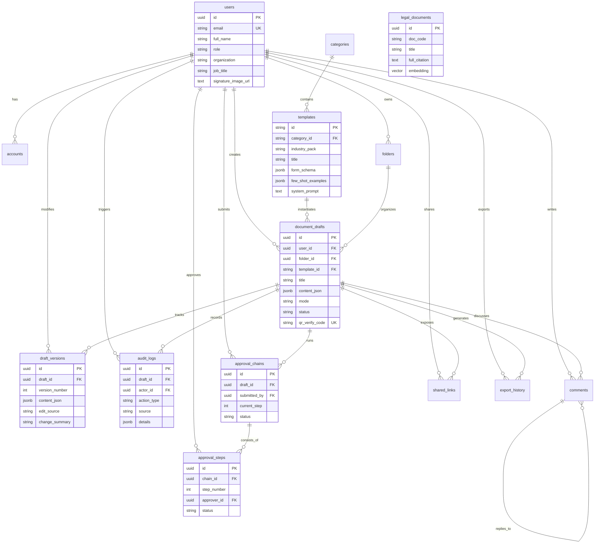

# THIẾT KẾ CƠ SỞ DỮ LIỆU & LƯỢC ĐỒ QUAN HỆ (DATABASE SCHEMA & ERD)

> **Mã tài liệu:** DATA-001  
> **Phân cấp ưu tiên:** **P0 (Critical — Bắt buộc trước khi code MVP)**  
> **Trạng thái:** Approved  
> **Hệ quản trị CSDL:** PostgreSQL 16 (Hỗ trợ pgvector & GIN FTS)  
> **Cập nhật lần cuối:** 2026-09-05  

---

## 1. BIỂU ĐỒ QUAN HỆ THỰC THỂ (MERMAID ERD DIAGRAM)



---

## 2. KỊCH BẢN DDL POSTGRESQL 16 HOÀN CHỈNH (EXECUTABLE SQL SCRIPT)

```sql
-- Kích hoạt tiện ích mở rộng vector và tìm kiếm
CREATE EXTENSION IF NOT EXISTS "uuid-ossp";
CREATE EXTENSION IF NOT EXISTS "vector";

-- ============================================================
-- 1. BẢNG NGƯỜI DÙNG (USERS)
-- ============================================================
CREATE TABLE users (
    id UUID PRIMARY KEY DEFAULT gen_random_uuid(),
    email VARCHAR(255) UNIQUE NOT NULL,
    password_hash VARCHAR(255),            -- NULL nếu đăng nhập OAuth Google
    full_name VARCHAR(255) NOT NULL,
    avatar_url TEXT,
    organization VARCHAR(255),             -- Cơ quan / Doanh nghiệp
    job_title VARCHAR(100),                -- Chức danh: Trưởng phòng, Chuyên viên
    role VARCHAR(20) DEFAULT 'USER',       -- 'USER', 'APPROVER', 'ADMIN', 'VIEWER'
    locale VARCHAR(10) DEFAULT 'vi',       -- 'vi', 'en'
    signature_image_url TEXT,              -- Ảnh chữ ký tay trong suốt
    custom_api_keys JSONB DEFAULT '{}',    -- Lưu trữ khóa API cá nhân mã hóa AES-256 (BYOK: DeepSeek, Gemini, OpenAI)
    preferences JSONB DEFAULT '{}',        -- Cấu hình cá nhân: font, theme
    email_verified BOOLEAN DEFAULT FALSE,
    created_at TIMESTAMP WITH TIME ZONE DEFAULT NOW(),
    updated_at TIMESTAMP WITH TIME ZONE DEFAULT NOW()
);

-- ============================================================
-- 2. BẢNG TÀI KHOẢN OAUTH (ACCOUNTS - NextAuth.js v5)
-- ============================================================
CREATE TABLE accounts (
    id UUID PRIMARY KEY DEFAULT gen_random_uuid(),
    user_id UUID NOT NULL REFERENCES users(id) ON DELETE CASCADE,
    provider VARCHAR(50) NOT NULL,         -- 'google', 'microsoft'
    provider_account_id VARCHAR(255) NOT NULL,
    access_token TEXT,
    refresh_token TEXT,
    expires_at BIGINT,
    UNIQUE(provider, provider_account_id)
);

-- ============================================================
-- 3. BẢNG DANH MỤC MẪU (CATEGORIES)
-- ============================================================
CREATE TABLE categories (
    id VARCHAR(50) PRIMARY KEY,
    name VARCHAR(100) NOT NULL,
    description TEXT,
    icon VARCHAR(50),
    sort_order INT DEFAULT 0,
    is_active BOOLEAN DEFAULT TRUE
);

-- ============================================================
-- 4. BẢNG MẪU VĂN BẢN (TEMPLATES) - Kèm Industry Pack
-- ============================================================
CREATE TABLE templates (
    id VARCHAR(100) PRIMARY KEY,
    category_id VARCHAR(50) REFERENCES categories(id),
    industry_pack VARCHAR(50),             -- 'HR', 'CONSTRUCTION', 'PROPERTY', 'EDU', 'STARTUP'
    title VARCHAR(255) NOT NULL,
    description TEXT,
    thumbnail_url TEXT,
    system_prompt TEXT NOT NULL,
    user_prompt_template TEXT NOT NULL,
    few_shot_examples JSONB DEFAULT '[]',  -- Cặp ví dụ mẫu input/output
    form_schema JSONB NOT NULL,            -- Schema Zod / JSON Schema cho Dynamic Form
    export_config JSONB DEFAULT '{}',      -- Cấu hình lề, font, kiểu bảng ẩn
    is_builtin BOOLEAN DEFAULT TRUE,       -- TRUE: mẫu hệ thống; FALSE: user tạo
    created_by UUID REFERENCES users(id),
    usage_count INT DEFAULT 0,
    avg_rating DECIMAL(2,1) DEFAULT 0.0,
    is_published BOOLEAN DEFAULT TRUE,
    created_at TIMESTAMP WITH TIME ZONE DEFAULT NOW(),
    updated_at TIMESTAMP WITH TIME ZONE DEFAULT NOW()
);

-- ============================================================
-- 5. BẢNG THƯ MỤC QUẢN LÝ (FOLDERS)
-- ============================================================
CREATE TABLE folders (
    id UUID PRIMARY KEY DEFAULT gen_random_uuid(),
    user_id UUID NOT NULL REFERENCES users(id) ON DELETE CASCADE,
    name VARCHAR(255) NOT NULL,
    parent_folder_id UUID REFERENCES folders(id),  -- Hỗ trợ thư mục lồng nhau
    color VARCHAR(7),                       -- Hex color ví dụ #2563eb
    sort_order INT DEFAULT 0,
    created_at TIMESTAMP WITH TIME ZONE DEFAULT NOW()
);

-- ============================================================
-- 6. BẢNG BẢN NHÁP VĂN BẢN (DOCUMENT DRAFTS)
-- ============================================================
CREATE TABLE document_drafts (
    id UUID PRIMARY KEY DEFAULT gen_random_uuid(),
    user_id UUID NOT NULL REFERENCES users(id) ON DELETE CASCADE,
    folder_id UUID REFERENCES folders(id) ON DELETE SET NULL,
    title VARCHAR(255) NOT NULL,
    template_id VARCHAR(100) REFERENCES templates(id),
    raw_input_data JSONB,                  -- Dữ liệu điền form hoặc text nháp thô
    content_json JSONB NOT NULL,           -- Tiptap ProseMirror JSON AST (Source of Truth)
    mode VARCHAR(20) DEFAULT 'FORM',       -- 'FORM', 'RAW_POLISH', 'IMPORT', 'SCAN_OCR'
    status VARCHAR(30) DEFAULT 'DRAFT',    -- 'DRAFT', 'PENDING_REVIEW', 'PENDING_APPROVAL', 'APPROVED', 'EXPORTED', 'ARCHIVED'
    language VARCHAR(10) DEFAULT 'vi',     -- 'vi', 'en', 'vi-en'
    current_version INT DEFAULT 1,
    word_count INT DEFAULT 0,
    last_compliance_score DECIMAL(3,0),    -- Điểm tuân thủ NĐ 30 (0 - 100)
    qr_verify_code VARCHAR(64) UNIQUE,     -- Mã tra cứu bản gốc online chống giả mạo
    created_at TIMESTAMP WITH TIME ZONE DEFAULT NOW(),
    updated_at TIMESTAMP WITH TIME ZONE DEFAULT NOW(),
    deleted_at TIMESTAMP WITH TIME ZONE    -- Soft delete (Trash 30 ngày)
);

-- ============================================================
-- 7. BẢNG LỊCH SỬ PHIÊN BẢN (DRAFT VERSIONS)
-- ============================================================
CREATE TABLE draft_versions (
    id UUID PRIMARY KEY DEFAULT gen_random_uuid(),
    draft_id UUID NOT NULL REFERENCES document_drafts(id) ON DELETE CASCADE,
    version_number INT NOT NULL,
    content_json JSONB NOT NULL,
    edit_source VARCHAR(30) NOT NULL,      -- 'AI_GENERATE', 'AI_INLINE_EDIT', 'AI_CHAT_APPLY', 'USER_MANUAL'
    change_summary VARCHAR(255),           -- Vd: "AI viết lại phần Nội dung"
    created_by UUID REFERENCES users(id),
    created_at TIMESTAMP WITH TIME ZONE DEFAULT NOW(),
    UNIQUE(draft_id, version_number)
);

-- ============================================================
-- 8. BẢNG NHẬT KÝ KIỂM TOÁN (AUDIT LOGS - AI ATTRIBUTION)
-- ============================================================
CREATE TABLE audit_logs (
    id UUID PRIMARY KEY DEFAULT gen_random_uuid(),
    draft_id UUID NOT NULL REFERENCES document_drafts(id) ON DELETE CASCADE,
    actor_id UUID REFERENCES users(id),
    action_type VARCHAR(50) NOT NULL,      -- 'CREATE', 'AI_APPLY', 'MANUAL_EDIT', 'SUBMIT_APPROVAL', 'APPROVE'
    source VARCHAR(30) NOT NULL,           -- 'AI' hoặc 'HUMAN'
    details JSONB,                         -- Diff tóm tắt, model đã gọi
    ip_address VARCHAR(45),
    created_at TIMESTAMP WITH TIME ZONE DEFAULT NOW()
);

-- ============================================================
-- 9. BẢNG LUỒNG TRÌNH KÝ & PHÊ DUYỆT (APPROVAL CHAINS & STEPS)
-- ============================================================
CREATE TABLE approval_chains (
    id UUID PRIMARY KEY DEFAULT gen_random_uuid(),
    draft_id UUID NOT NULL REFERENCES document_drafts(id) ON DELETE CASCADE,
    submitted_by UUID NOT NULL REFERENCES users(id),
    current_step INT DEFAULT 1,
    status VARCHAR(20) DEFAULT 'PENDING',  -- 'PENDING', 'APPROVED', 'REJECTED'
    note TEXT,
    created_at TIMESTAMP WITH TIME ZONE DEFAULT NOW(),
    completed_at TIMESTAMP WITH TIME ZONE
);

CREATE TABLE approval_steps (
    id UUID PRIMARY KEY DEFAULT gen_random_uuid(),
    chain_id UUID NOT NULL REFERENCES approval_chains(id) ON DELETE CASCADE,
    step_number INT NOT NULL,              -- 1: Trưởng phòng, 2: Giám đốc
    approver_id UUID NOT NULL REFERENCES users(id),
    status VARCHAR(20) DEFAULT 'WAITING',  -- 'WAITING', 'APPROVED', 'REJECTED', 'REQUEST_CHANGES'
    comments TEXT,
    signature_applied BOOLEAN DEFAULT FALSE,
    action_at TIMESTAMP WITH TIME ZONE
);

-- ============================================================
-- 10. BẢNG CĂN CỨ PHÁP LÝ (LEGAL DOCUMENTS - RAG PGVECTOR)
-- ============================================================
CREATE TABLE legal_documents (
    id UUID PRIMARY KEY DEFAULT gen_random_uuid(),
    doc_code VARCHAR(100) NOT NULL,        -- '10/2021/NĐ-CP'
    title TEXT NOT NULL,                   -- 'Nghị định về quản lý chi phí...'
    doc_type VARCHAR(50),                  -- 'Luật', 'Nghị định', 'Thông tư'
    issuing_authority VARCHAR(100),        -- 'Chính phủ', 'Bộ Xây dựng'
    issued_date DATE,
    effective_date DATE,
    status VARCHAR(30) DEFAULT 'ACTIVE',   -- 'ACTIVE', 'EXPIRED', 'REPLACED'
    full_citation TEXT NOT NULL,           -- Đoạn trích dẫn hoàn chỉnh
    category_id VARCHAR(50),
    embedding vector(768),                 -- Vector embedding từ Gemini Text Embedding
    created_at TIMESTAMP WITH TIME ZONE DEFAULT NOW()
);

-- ============================================================
-- 11. BẢNG CHIA SẺ & BÌNH LUẬN (COLLABORATION)
-- ============================================================
CREATE TABLE shared_links (
    id UUID PRIMARY KEY DEFAULT gen_random_uuid(),
    draft_id UUID NOT NULL REFERENCES document_drafts(id) ON DELETE CASCADE,
    shared_by UUID NOT NULL REFERENCES users(id),
    share_token VARCHAR(64) UNIQUE NOT NULL,
    permission VARCHAR(20) DEFAULT 'VIEW', -- 'VIEW', 'COMMENT', 'EDIT'
    password_hash VARCHAR(255),
    expires_at TIMESTAMP WITH TIME ZONE,
    use_count INT DEFAULT 0,
    created_at TIMESTAMP WITH TIME ZONE DEFAULT NOW()
);

CREATE TABLE comments (
    id UUID PRIMARY KEY DEFAULT gen_random_uuid(),
    draft_id UUID NOT NULL REFERENCES document_drafts(id) ON DELETE CASCADE,
    user_id UUID NOT NULL REFERENCES users(id),
    parent_comment_id UUID REFERENCES comments(id),
    content TEXT NOT NULL,
    anchor_json JSONB,                     -- Tọa độ vị trí chữ được gắn comment
    is_resolved BOOLEAN DEFAULT FALSE,
    created_at TIMESTAMP WITH TIME ZONE DEFAULT NOW()
);

-- ============================================================
-- 12. BẢNG LỊCH SỬ XUẤT BẢN (EXPORT HISTORY)
-- ============================================================
CREATE TABLE export_history (
    id UUID PRIMARY KEY DEFAULT gen_random_uuid(),
    draft_id UUID NOT NULL REFERENCES document_drafts(id),
    user_id UUID NOT NULL REFERENCES users(id),
    format VARCHAR(10) NOT NULL,           -- 'docx', 'pdf'
    file_url TEXT NOT NULL,
    file_size_bytes BIGINT,
    has_image_signature BOOLEAN DEFAULT FALSE,
    created_at TIMESTAMP WITH TIME ZONE DEFAULT NOW()
);

-- ============================================================
-- INDEXES HIỆU NĂNG CAO
-- ============================================================
CREATE INDEX idx_drafts_user_id ON document_drafts(user_id);
CREATE INDEX idx_drafts_folder_id ON document_drafts(folder_id);
CREATE INDEX idx_drafts_status ON document_drafts(status);
CREATE INDEX idx_drafts_deleted_at ON document_drafts(deleted_at);
CREATE INDEX idx_versions_draft ON draft_versions(draft_id, version_number DESC);
CREATE INDEX idx_templates_industry ON templates(industry_pack);
CREATE INDEX idx_audit_draft_id ON audit_logs(draft_id);
CREATE INDEX idx_chains_draft_id ON approval_chains(draft_id);

-- Full-text Search Index cho tiếng Việt (dùng từ điển simple)
CREATE INDEX idx_drafts_fts ON document_drafts USING GIN (to_tsvector('simple', title));
CREATE INDEX idx_legal_fts ON legal_documents USING GIN (to_tsvector('simple', title || ' ' || full_citation));

-- Vector Index cho Semantic Search RAG (HNSW Index)
CREATE INDEX idx_legal_embedding ON legal_documents 
USING hnsw (embedding vector_cosine_ops)
WITH (m = 16, ef_construction = 64);
```
