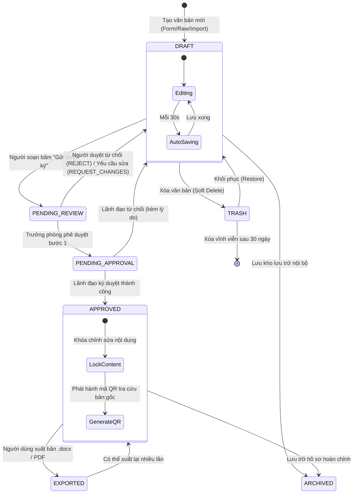
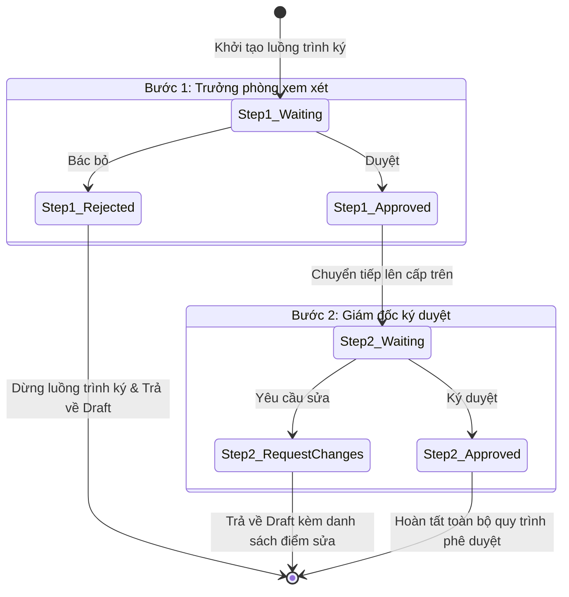

# THIẾT KẾ MÁY TRẠNG THÁI VĂN BẢN & QUY TRÌNH PHÊ DUYỆT (STATE MACHINES)

> **Mã tài liệu:** DATA-002  
> **Phân cấp ưu tiên:** **P1 (High — Hoàn thiện Core Engines Phase 1–2)**  
> **Trạng thái:** Approved  
> **Áp dụng:** Quản lý vòng đời tài liệu và quy trình trình ký tổ chức  
> **Cập nhật lần cuối:** 2026-09-05  

---

## 1. MÁY TRẠNG THÁI VÒNG ĐỜI VĂN BẢN (DOCUMENT DRAFT LIFECYCLE)

### 1.1. Biểu đồ chuyển trạng thái (Mermaid State Diagram)



---

## 2. MA TRẬN CHUYỂN TRẠNG THÁI CHI TIẾT (TRANSITION MATRIX)

| Trạng thái hiện tại | Sự kiện kích hoạt (Event) | Điều kiện kiểm tra (Guard Condition) | Trạng thái tiếp theo | Tác vụ phụ đi kèm (Side-effects) |
|---|---|---|---|---|
| **DRAFT** | `SAVE_CHANGES` | Quyền `EDIT`, không có xung đột phiên bản | **DRAFT** | Tăng `current_version`, ghi bản ghi mới vào `draft_versions` |
| **DRAFT** | `SUBMIT_APPROVAL` | Còn 0 placeholder chưa điền, đã kiểm tra thể thức NĐ 30 | **PENDING_REVIEW** | Khởi tạo bản ghi trong `approval_chains`, gửi thông báo cho Approver bước 1 |
| **PENDING_REVIEW** | `APPROVE_STEP_1` | Người dùng có vai trò `APPROVER` của bước 1 | **PENDING_APPROVAL** | Cập nhật `approval_steps[1].status = 'APPROVED'`, gửi thông báo cho Lãnh đạo |
| **PENDING_REVIEW** | `REJECT` | Người duyệt nhập lý do từ chối (bắt buộc) | **DRAFT** | Cập nhật trạng thái chuỗi thành `REJECTED`, mở khóa quyền sửa cho người soạn |
| **PENDING_APPROVAL**| `APPROVE_FINAL` | Lãnh đạo xác nhận ký duyệt | **APPROVED** | Khóa `content_json` (read-only), sinh `qr_verify_code`, chèn ảnh chữ ký |
| **PENDING_APPROVAL**| `REQUEST_CHANGES`| Lãnh đạo nhập danh sách điểm cần sửa | **DRAFT** | Gắn comment chỉ dẫn vào các đoạn cần sửa |
| **APPROVED** | `EXPORT_FILE` | Có quyền xem văn bản | **EXPORTED** | Tạo file binary `.docx` hoặc PDF kèm mã QR xác thực |
| **Bất kỳ trạng thái**| `MOVE_TO_TRASH` | Là chủ sở hữu hoặc Admin | **TRASH** | Cập nhật `deleted_at = NOW()` |
| **TRASH** | `RESTORE` | Trong vòng 30 ngày kể từ `deleted_at` | Trạng thái cũ | Đặt `deleted_at = NULL` |

---

## 3. MÁY TRẠNG THÁI LUỒNG TRÌNH KÝ (APPROVAL WORKFLOW CHAIN)

Mỗi chuỗi trình ký (`approval_chains`) quản lý một danh sách tuần tự các bước ký duyệt (`approval_steps`):



---

## 4. QUY TẮC KHÓA LẠC QUAN & XỬ LÝ ĐỒNG THỜI (OPTIMISTIC LOCKING)

Để tránh tình trạng 2 người cùng chỉnh sửa một văn bản và vô tình ghi đè mất công sức của nhau:
1. Mọi lệnh cập nhật `PUT /api/drafts/:id` đều bắt buộc gửi kèm `current_version`.
2. Truy vấn SQL kiểm tra điều kiện:
   ```sql
   UPDATE document_drafts
   SET content_json = $1, current_version = current_version + 1, updated_at = NOW()
   WHERE id = $2 AND current_version = $3;
   ```
3. Nếu số dòng cập nhật trả về = 0 (tức đã có người khác cập nhật phiên bản mới hơn trên máy chủ):
   * Backend trả về lỗi `409 Conflict`.
   * Frontend hiển thị hộp thoại cảnh báo: *"Văn bản này vừa được cập nhật bởi một phiên làm việc khác. Bạn muốn xem bản khác biệt (Diff) hay ghi đè một bản sao mới?"*
